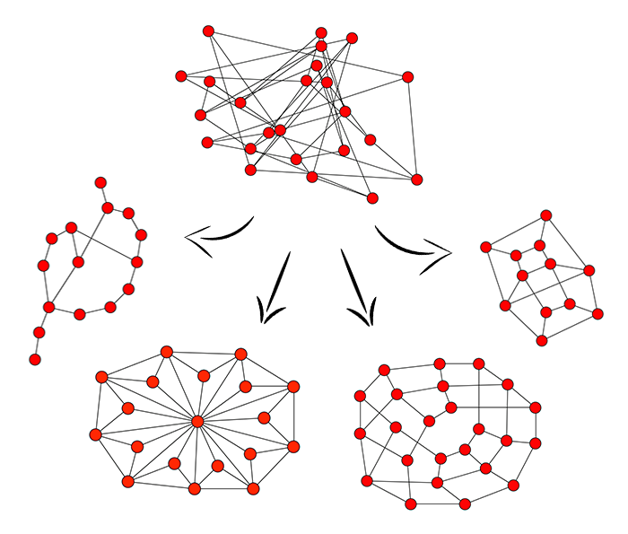

# PrettyGraphs

Make your graphs pretty and user-friendly using simulated annealing and hill climbing. Just input the vertices and the edges which connect them, and PrettyGraphs will output the position of the vertices such that the graph is visually pleasant.



### Quick Demo
To see the algorithms in action, simply run `$ python tests.py`. The algorithm will output the various states the graph goes through and then display two graphs: a randomly generated one (used as the initial state) and the final generated one.

You can also modify which demo you are visualizing by going to the bottom of the `tests.py` file and uncommenting different matrices or the algorithm being used (hill climbing or simulated annealing). Just follow the commented instructions.

How To Use It
-------------
(Dependencies: [networkx](https://networkx.github.io/), [matplotlib](http://matplotlib.org/))

Before running the algorithms, you will need a representation of the graph. Thankfully, we provide you with an easy to use one.
```python
from utils.MatrixPrototypes import AdjacencyMatrix, MatrixIterator, EdgeIterator

matrix = AdjacencyMatrix(numberOfVertices)
matrix.addVertices(["Name", "Of", "Each", "Vertex"])
matrix.addEdges("Name", "Of") # now edges 'Name' and 'Of' are connected.
```

To run the algorithm, run one of the lines below. It will return a dictionary with the optimal positions of each vertex.
```python
from hillclimb import climbhill
from simulatedannealing import simulateanneal

finalSolution, finalScore, numTries = climbhill(matrix, initialSolution)
# or...
finalSolution, finalScore = simulateanneal(matrix, initialSolution)
```
If you don't have a prefeered initialSolution, you can get a randomized one by running:
```python
from randomPermutation import getRandom

initialSolution = getRandom(matrix.vertices)
```

Finally, you can visualize any solution by running:
```python
from utils import viz

viz.display(matrix, solution)
```

How It Works
------------
Hill Climbing is an iterative algorithm that starts with an arbitrary solution to a problem, then attempts to find a better solution by incrementally changing a single element of the solution. If the change produces a better solution, an incremental change is made to the new solution, repeating until no further improvements can be found.

Simulated Annealing is a probabilistic metaheuristic algorithm that attempts to find a good (or global optimal) solution. It also starts with an arbitraty solution, then uses probability to determine how, and how much it should change that solution. It takes more risks than Hill Climbing, but it also usually produces better results.

How To Tweak It
---------------
Different graphs will require different weights for the heuristics in the score function. If you want to modify these weihts, it can easily be done. Just go into the `score.py` file and modify the weights there. Be sure to also modify the weights in the diagnose function, if you're using it.

How To Contribute To It
-----------------------
### How To Add Heuristics
You can add heuristics to the score function. Just create a python file that takes in an AdjacencyMatrix and/or a proposed solution and outputs a normalized value from 0 to 1 (1 being best). Add this file to `/evals` and add its name to `/evals/__init__.py`. Now you can modify the score function to take it into account. Remember to normalize the final score by adding the maxValue to the bottom of the division in the return statement. The maxValue of your heuristic should be its weight, if the score your file outputs is properly normalized.
